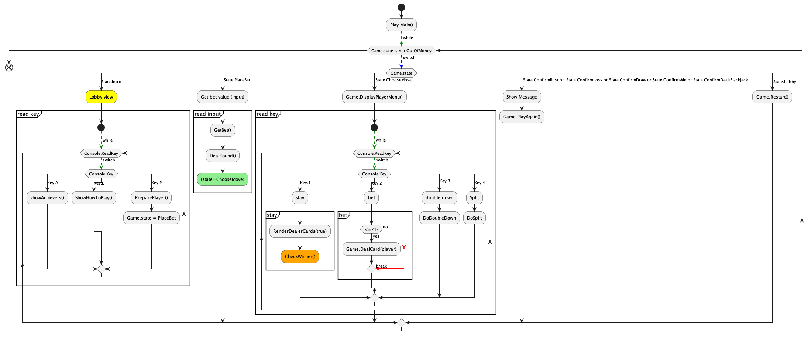

# OPAIC_blackJack
## Otago Polytechnic - OPAIC BIT Programing 1 Final Submission
---
## The Motive
    A proof of console game concept black jack (21) implemented in C# 
---
Assignment As Problem: 
   
    TASK
    Your task is to identify a suitable game idea and code the game, using C# in Visual Studio.
    Your code should include the following:
    TODO:
    1. Menus from which the user can select items.
    2. Use of random numbers generated by the computer.
    3. Use of array(s) of struct.
    4. Use of methods.
    5. Reading data from a simple text file.
    6. Sorting data.
    7. Updating data.
    8. Writing data to a simple text file.
    9. Internal documentation i.e., adequate comments in the code.
    Feel free to include anything else.
    Submit your code (.cs files) via Moodle, along with at least one Activity Diagram, Screenshots of output and a list of any bugsand other issues.
    Answer questions to demonstrate that you understand the code submitted by you.
    Note: This is an individual assignment. You must be able to explain your code fully during the defense. If you are unable to explain the code submitted by you, you will receive a zero mark for this assignment.

---


--- 

## Solution: As ( BlackJack Game )

    Menus: 
        - betting menu select
        - replay menu char input

    Random No.
        - Acknowledged in Dealing cards

    Arrays of Struct
        - Used Enums , Class and Custom data types
    Use of methods: 
        - Applied

    CRUD operation to file
        - In place txt style player db file .

    Documentation
        - Found At: [README.md](README.md)


---
## Class Diagram

## Activity Diagram
 

 ## Screen shots


## Demo


## build
```
cd BlackJack

# builds windows .dll as default

dotnet build

dotnet publish -r osx-x64 --self-contained true

or linux
dotnet publish -r linux-x64 --self-contained true

```
## run debug
```
dotnet run --verbosity quiet
```

## test

```
dotnet test --verbosity m
```

## featured

~~Currently our BJ game has abitlity to hit or stay , implementing double down and split next release.~~

* needs more tests.
* splitting doesn't abide by poker international standards " need to handle Ace split and more payout testing".
* Refactor Game class into smaller maintainable chuncks. 
* ## Mile Stone 
   - Add socket functionality as a network game 
   - Allow buying in.
   - set user timmeout for idle game \
    **"Feel free to fork and pr"
---
  
## LICENSE    
[ GNU GENERAL PUBLIC LICENSE ](./LICENSE)
### Maintainer:
Ahmed A. <ahbox@outlook.com>

## Mentors:

    Prof. Tariq Khan  
    Prof. Kathiravelu Ganeshan     
    Head of department: Prof. Farhad Mehdipour

 


